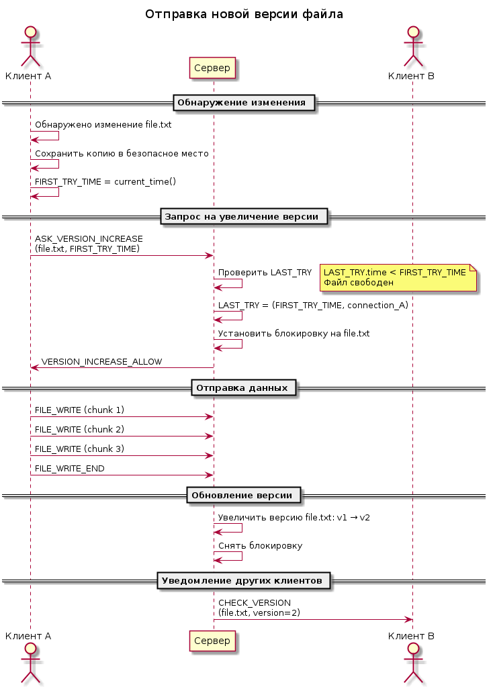
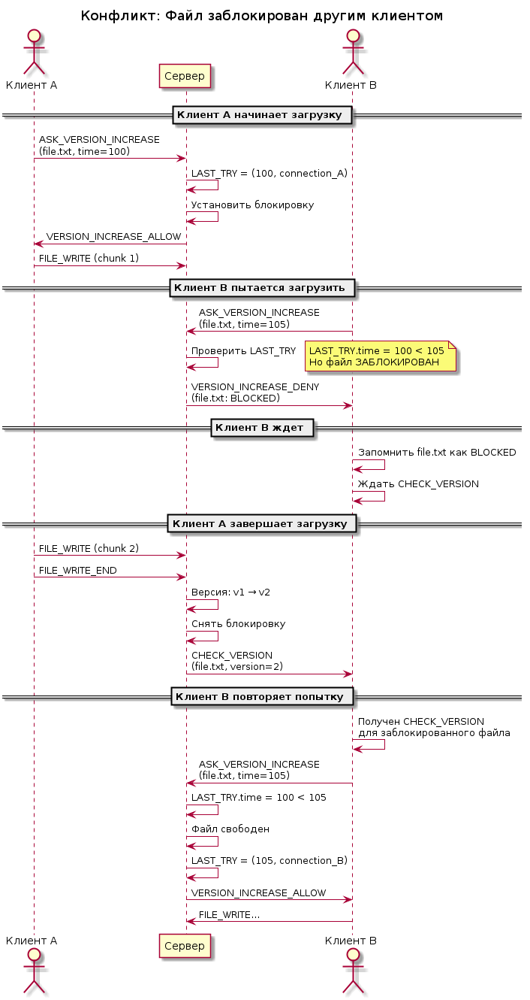
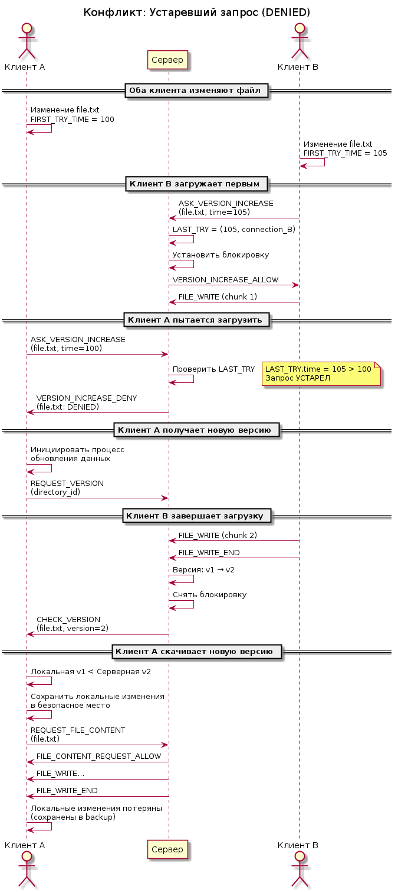
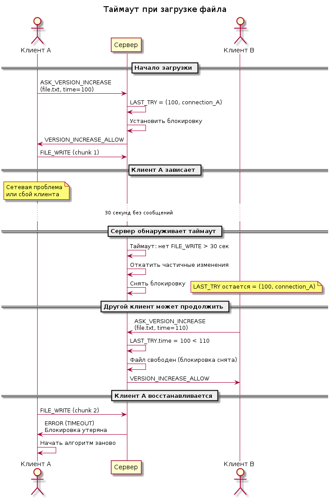
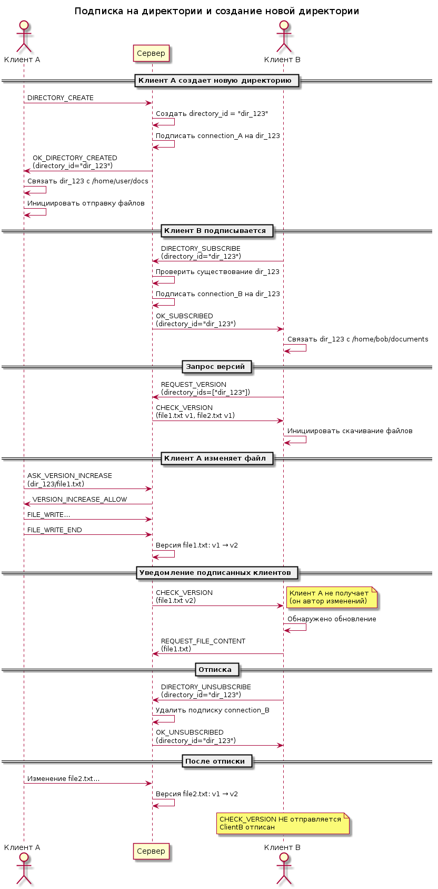
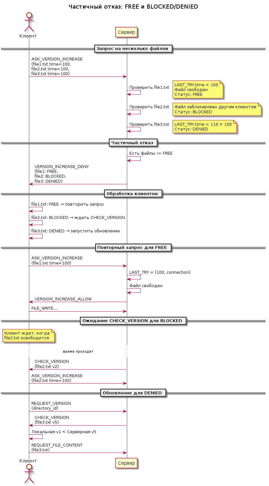

<!--
TODO:
Кто ответственнен за нужные переименования при переименовании директории?
Что происходит если файл переименовывается на уже существующий (перезаписывается)? Прописать корнер-кейсы с бекапом.
-->

# Спецификация формата взаимодействия

Данный документ стандартизирует взаимодействие между клиентами и сервером SynXpo.

## Оглавление
- [Общая информация](#общая-информация)
- [Подписка на директории](#подписка-на-директории)
  - [Создание директории](#создание-директории)
  - [Подписка на директорию](#подписка-на-директорию)
  - [Отписка от директории](#отписка-от-директории)
- [Отправка новой версии](#отправка-новой-версии)
  - [Клиент](#клиент)
  - [Сервер](#сервер)
- [Обновление данных](#обновление-данных)
  - [Клиент](#клиент-1)
  - [Сервер](#сервер-1)
- [Диаграммы взаимодействия](#диаграммы-взаимодействия)

## Общая информация
- Клиент и сервер общаются по протоколу gRPC.
- *Единицей синхронизации* называется такой объект, что:
  1. Гарантируется идентичность таких объектов на устройствах, между которыми установлена синхронизация;
  2. Идентичность родителей этих объектов не гарантируется.
- Единицами синхронизации являются директории. Приложение обеспечивает идентичность содержимого директорий на разных устройствах. Далее в тексте слово *директория* следует понимать как *единица синхронизации*, если не указано иное.
- Директория представляет собой список файлов. Поддиректории этой директории считаются файлами с типом `FOLDER`.
- Каждый файл ассоциируется со метаданными:
  - `ID` — id файла в формате `uuid4`;
  - `DIRECTORY_ID` — id директории в формате `uuid4`;
  - `VERSION` — версия, целое беззнаковое 64-битное число. Версии нумеруются с 1;
  - `CONTENT_CHANGED_VERSION` — последняя версия, в которой изменялось содержимое файла;
  - `TYPE` — тип файла, `FILE` или `FOLDER`;
  - `CURRENT_PATH` — текущий путь к файлу относительно единицы синхронизации;
  - `DELETED` — флаг, показывающий, удалён ли файл.
- Временная метка представляется Unix timestamp в микросекундах (`TIMESTAMP`).
- Каждое сообщение клиента может содержать опциональное поле `REQUEST_ID` (uuid4) для корреляции запросов и ответов. Сервер ДОЛЖЕН включать это поле в соответствующий ответ, если оно было в запросе.
- Сообщения сервера, являющиеся ответами на запросы клиента (`OK_*`, `VERSION_INCREASE_ALLOW`, `VERSION_INCREASE_DENY`, `VERSION_INCREASED`, `FILE_CONTENT_REQUEST_ALLOW`, `FILE_CONTENT_REQUEST_DENY`), содержат `REQUEST_ID` из исходного запроса.
- Сообщения сервера, инициированные сервером (`CHECK_VERSION`, `FILE_WRITE`, `FILE_WRITE_END`), не содержат `REQUEST_ID`.
- Сервер хранит для каждого файла структуру `LAST_TRY = (time, connection_id)`, где `time` — временная метка последнего запроса `ASK_VERSION_INCREASE`, `connection_id` — внутренний идентификатор gRPC-соединения, от которого пришел запрос. Для новых файлов `LAST_TRY` инициализируется значением `(0, null)`.
- Событие `CHECK_VERSION` содержит метаданные файлов, которые изменились.

## Подписка на директории
### Создание директории
1. Для создания новой директории, файлы в которой будут синхронизироваться, клиент отправляет серверу запрос `DIRECTORY_CREATE`, на что сервер отвечает сообщением `OK_DIRECTORY_CREATED` с полем `DIRECTORY_ID`.
2. Клиент сам связывает полученный id с некоторой локальной директорией. Сервер не знает местоположение этой директории, только её содержимое.
3. После получения `OK_DIRECTORY_CREATED` клиент инициирует отправку новой версии по обычным правилам.

### Подписка на директорию
1. Для подписки на уже существующую директорию клиент отправляет серверу запрос `DIRECTORY_SUBSCRIBE`, содержащий id директории, на что сервер отвечает сообщением `OK_SUBSCRIBED`.
2. После этого сервер ОБЯЗАН отправлять события `CHECK_VERSION` при изменении файлов в этой директории.
3. Клиент ОБЯЗАН подписываться на релевантные директории при каждом запуске, так как подписки связаны с gRPC-соединением и удаляются при его разрыве.
4. После подписки на директорию клиент инициирует обновление данных по обычным правилам.

### Отписка от директории
1. Для отписки от директории клиент отправляет серверу запрос `DIRECTORY_UNSUBSCRIBE`, содержащий id директории, на что сервер отвечает сообщением `OK_UNSUBSCRIBED`.
2. После этого сервер не отправляет события `CHECK_VERSION` при изменении файлов в этой директории.
3. Если клиент всё же продолжает получать такие события, он обязан их игнорировать.

## Отправка новой версии

### Клиент
1. Клиент периодически проверяет, не изменились ли файлы, за которыми установлено отслеживание. Под изменением понимается изменение содержимого, переименование или удаление файла.
2. Если произошло изменение, клиент немедленно сохраняет локальную измененную копию файла в безопасное место.
3. Если произошло изменение, клиент устанавливает параметр `FIRST_TRY_TIME: TIMESTAMP` для этого файла, используя текущее время. При дальнейшей отправке запросов этот параметр не должен изменяться, если только файл не был снова модифицирован.
4. Если произошло изменение, клиент отправляет на сервер запрос `ASK_VERSION_INCREASE` с указанием списка файлов, которые изменились. Для каждого файла указывается его id, метаданные: `CURRENT_PATH`, `DELETED`, а также флаг `CONTENT_CHANGED`, указывающий, поменялось ли содержимое файла. Поле `ID` может быть опциональным в случае если файл создаётся — тогда id генерирует сервер и возращает его в ответе `VERSION_INCREASED` по окончании записи.
5. Сервер проверяет, не записывает ли какой-то другой клиент сейчас изменения в один из файлов (поток заблокирован). 
6. Если хотя бы один файл заблокирован, сервер возвращает ответ `VERSION_INCREASE_DENY` с указанием списка заблокированных файлов. Для каждого файла указан статус: `FREE`, `BLOCKED`, `DENIED`. Клиент ОБЯЗАН:
    1. Для незаблокированных файлов (`FREE`) немедленно повторить запрос `ASK_VERSION_INCREASE` и следовать этому алгоритму.
    2. Запомнить заблокированные файлы (`BLOCKED`) и повторить запрос `ASK_VERSION_INCREASE` при получении события `CHECK_VERSION`, затрагивающего заблокированные файлы, после чего следовать этому алгоритму.
    3. Для файлов `DENIED` инициировать процесс обновления данных после завершения алгоритма отправки новой версии.
7. Если никакой файл не заблокирован, и в запросе `ASK_VERSION_INCREASE` для всех файлов флаг `CONTENT_CHANGED` установлен в `FALSE`, сервер возвращает ответ `VERSION_INCREASED` с указанием метаданных изменённых файлов: `ID`, `VERSION`, `CONTENT_CHANGED_VERSION`, `CURRENT_PATH`, `DELETED`. Клиент обновляет соответствующие локальные метаданные. Алгоритм завершается.
8. Если никакой файл не заблокирован, и в запросе `ASK_VERSION_INCREASE` хотя бы для одного файла флаг `CONTENT_CHANGED` установлен в `TRUE`, сервер возвращает ответ `VERSION_INCREASE_ALLOW`. Клиент ОБЯЗАН немедленно начать отправку потока сообщений `FILE_WRITE` с содержимым обновляемых файлов, после чего закончить отправку сообщением `FILE_WRITE_END`. 
9. После получения сообщения `FILE_WRITE_END` сервер также возвращает ответ `VERSION_INCREASED` с указанием метаданных изменённых файлов. Клиент обновляет локальные метаданные из полученного ответа.
10. Клиент ДОЛЖЕН разбивать файлы на фрагменты размером не более 1 MB и отправлять их последовательными сообщениями `FILE_WRITE`, чтобы гарантировать интервал между сообщениями менее 30 секунд даже при медленном соединении.
11. В случае если между отправками `FILE_WRITE` пройдёт более 30 секунд, сервер снимет блокировку со всех файлов и откатит изменения, после чего следующие запросы `FILE_WRITE` упадут с ошибкой. При получении ошибки клиент ОБЯЗАН начать алгоритм заново.
12. После завершения алгоритма клиент возобновляет отслеживание файлов. Во время выполнения данного алгоритма отслеживание не должно выполняться во избежание конфликтов (исключение: пункт 6.2).

### Сервер
1. При получении запроса `ASK_VERSION_INCREASE` сервер проверяет, есть ли запись о данном файле. Если записи нет, она создаётся.
2. Для каждого отправленного файла сервер проверяет структуру `LAST_TRY = (time, connection_id)`, которую он хранит у себя.
    1. Если `LAST_TRY.time > FIRST_TRY_TIME`, сервер немедленно помечает файл как `DENIED`.
    2. Если `LAST_TRY.time < FIRST_TRY_TIME` ИЛИ если `LAST_TRY.time == FIRST_TRY_TIME` И `LAST_TRY.connection_id` совпадает с текущим соединением (повторный запрос того же клиента), сервер устанавливает `LAST_TRY = (FIRST_TRY_TIME, connection_id)` и:
        1. Если в файл сейчас кто-то пишет или из него кто-то читает, помечает его как `BLOCKED`.
        2. Иначе помечает его как `FREE`.
    3. Иначе сервер помечает файл как `DENIED`.
3. Если хотя бы один файл не помечен как `FREE`, сервер отправляет ответ `VERSION_INCREASE_DENY` и завершает обработку.
4. Иначе сервер помечает, что в запрошенные файлы идёт запись.
5. Для всех файлов сервер сверяет значения полей `CURRENT_PATH` и `DELETED` и обновляет их у себя при необходимости.
6. Если в запросе нет файлов, для которых установлен флаг `CONTENT_CHANGED`, сервер отправляет ответ `VERSION_INCREASED`, снимает блокировки и переходит к пункту 11.
7. Иначе сервер сохраняет свои версии файлов, для которых установлен флаг `CONTENT_CHANGED`, в безопасное место и отправляет ответ `VERSION_INCREASE_ALLOW`.
8. После отправки `VERSION_INCREASE_ALLOW` сервер ожидает первое сообщение `FILE_WRITE` в течение 10 секунд. Если сообщение не получено, блокировка освобождается.
9. Сервер принимает все файлы и записывает их к себе в хранилище.
10. Сервер отслеживает время последнего полученного сообщения `FILE_WRITE` от клиента. Если сервер не получает очередное сообщение `FILE_WRITE` или завершающее сообщение `FILE_WRITE_END` в течение 30 секунд с момента предыдущего сообщения, он:
    1. Откатывает все частично записанные изменения для данного клиента.
    2. Освобождает блокировки на соответствующие файлы.
    3. Не увеличивает версии файлов.
11. Для каждого файла, содержимое которого изменилось, сервер увеличивает `CONTENT_CHANGED_VERSION` на 1.
12. Для каждого изменённого файла сервер увеличивает его версию на 1.
13. После получения сообщения `FILE_WRITE_END` или после отправки ответа `VERSION_INCREASED` сервер отправляет событие `CHECK_VERSION` всем клиентам, подписанным на изменённые файлы, кроме клиента который производил запись. Событие содержит полные метаданные файлов: `ID`, `VERSION`, `CONTENT_CHANGED_VERSION`, `CURRENT_PATH`, `DELETED`.
14. Если в запросе содержались файлы с установленным флагом `DELETED`, сервер удаляет их содержимое и записи о них.

## Обновление данных

### Клиент
Клиент инициирует обновление данных у себя:
1. При запуске, отправляя команду `REQUEST_VERSION` со списком id отслеживаемых директорий. На эту команду сервер отвечает отправкой события `CHECK_VERSION`.
2. При получении события `CHECK_VERSION`.
3. При получении ответа `DENIED` на запрос `ASK_VERSION_INCREASE`, отправляя команду `REQUEST_VERSION` со списком файлов, которые были помечены как `DENIED`.

Процесс обновления данных происходит следующим образом:
1. Клиент сравнивает версии файлов, полученные от сервера, с локальными версиями.
2. Клиент переименовывает или удаляет файлы при необходимости. Каждое переименование записывается, а каждый удалённый файл сохраняется в безопасном месте для обеспечения возможности отката.
3. Клиент запрашивает содержимое файлов, у которых `CONTENT_CHANGED_VERSION` на сервере превышает `CONTENT_CHANGED_VERSION` на клиенте. Для этого он сохраняет текущие локальные версии в безопасное место и отправляет запрос `REQUEST_FILE_CONTENT` с необходимым списком файлов.
3. Если в какой-то из запрошенных файлов сейчас идёт запись, сервер возвращает ответ `FILE_CONTENT_REQUEST_DENY`. Для каждого файла указан статус: `FREE`, `BLOCKED`. Клиент ОБЯЗАН:
    1. Для незаблокированных файлов (`FREE`) немедленно повторить запрос `REQUEST_FILE_CONTENT` и следовать этому алгоритму.
    2. Не делать ничего для заблокированных файлов, так как при окончании записи он снова получит событие `CHECK_VERSION`.
4. Если никакой файл не заблокирован, сервер возвращает ответ `FILE_CONTENT_REQUEST_ALLOW`, после чего поток событий `FILE_WRITE`, оканчивающийся событием `FILE_WRITE_END`. Клиент записывает данные в релевантные файлы. Во избежание конфликтов, перед началом записи клиент должен заблокировать релевантные файлы для записи другими программами средствами операционной системы.
5. В случае если между получением сообщений `FILE_WRITE` от сервера пройдёт более 30 секунд, клиент восстанавливает файлы из сохранённых резервных копий, снимает блокировки и повторяет запрос `REQUEST_FILE_CONTENT` заново. При этом он игнорирует все последующие события `FILE_WRITE` до тех пор, пока не получит `FILE_WRITE_END`.
6. После получения всех данных клиент обрабатывает файлы, у которых отсутствует версия, запуская для них процесс отправки новой версии, как описано выше.
7. Для файлов, у которых текущая версия превышает версию на сервере, клиент ничего не делает, так как они уже были обновлены на сервере.
8. Если на клиенте имеются файлы из запрошенных директорий с ненулевой версией, которые не были получены после `REQUEST_VERSION` при запуске, они удаляются локально (так как были удалены на сервере). Перед этим каждый удалённый файл сохраняется в безопасном месте для обеспечения возможности отката.

Во время получения данных клиент не должен прерываться на проверку наличия локальных изменений во избежание конфликтов.

### Сервер
1. При получении запроса `REQUEST_FILE_CONTENT` для каждого запрошенного файла сервер проверяет, не ведётся ли в него запись, и помечает файлы `BLOCKED` или `FREE` соответственно.
2. Если хотя бы один файл не помечен как `FREE`, сервер отправляет ответ `FILE_CONTENT_REQUEST_DENY` и завершает обработку.
3. Иначе сервер блокирует релевантные файлы для записи другими клиентами, отправляет ответ `FILE_CONTENT_REQUEST_ALLOW`, после чего отправляет сообщения `FILE_WRITE` с содержимым файлов, а затем событие `FILE_WRITE_END` и разблокирует файлы.
4. Сервер ДОЛЖЕН разбивать файлы на фрагменты размером не более 1 MB и отправлять их последовательными сообщениями `FILE_WRITE`, чтобы гарантировать интервал между сообщениями менее 30 секунд даже при медленном соединении.

## Диаграммы взаимодействия

### Отправка новой версии файла

### Получение обновленных файлов

### Конфликт: файл заблокирован другим клиентом

### Конфликт: устаревший запрос (DENIED)

### Таймаут при загрузке файла

### Подписка на директории

### Частичный отказ: FREE и BLOCKED/DENIED
